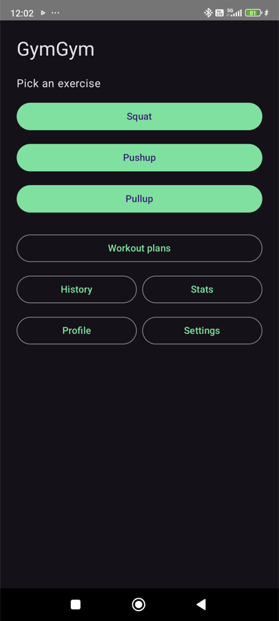
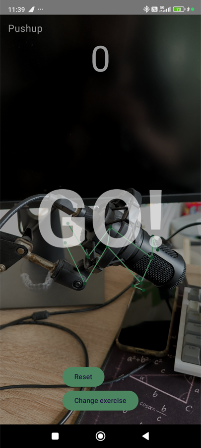
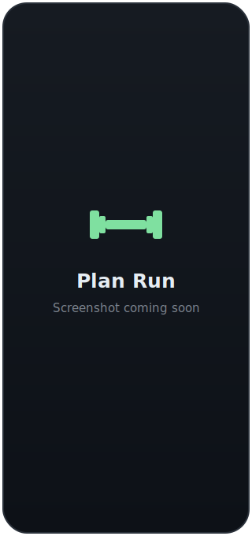
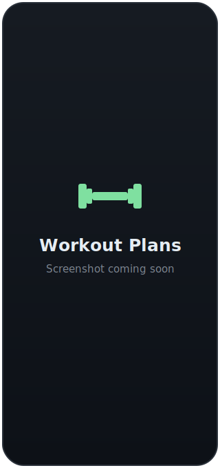
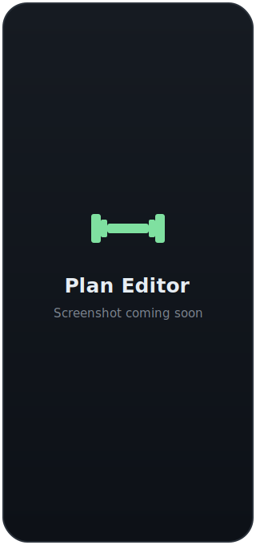
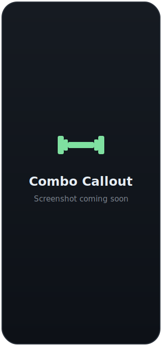
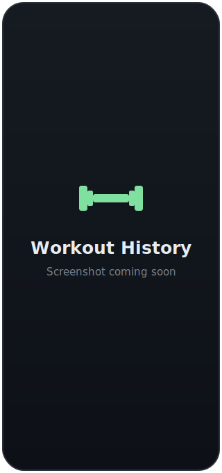
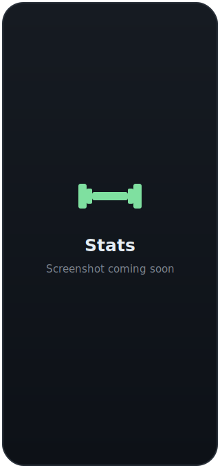
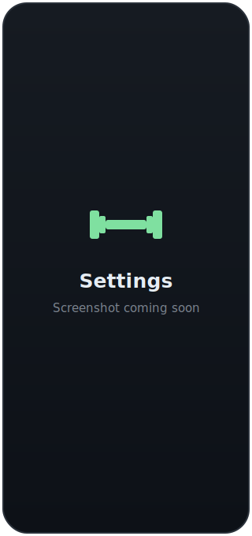

<div align="center">

# 🏋️ GymGym

**Count your reps hands-free. Point your phone, and it watches you work out.**

GymGym is a native Android app that uses the phone camera and on-device pose
detection to automatically count workout reps — no wearables, no accounts, no
internet. Everything runs and stays on your device.


-blue)




</div>

---

## Table of contents

- [Overview](#overview)
- [Features](#features)
- [Screenshots](#screenshots)
- [How it works](#how-it-works)
- [Tech stack](#tech-stack)
- [Project structure](#project-structure)
- [Getting started](#getting-started)
- [Usage](#usage)
- [Settings](#settings)
- [Privacy & permissions](#privacy--permissions)
- [Roadmap](#roadmap)
- [Development](#development)
- [License](#license)

## Overview

GymGym turns your phone into a rep counter. Prop it up so it can see you, pick
an exercise, and after a spoken countdown it tracks your body with
[ML Kit Pose Detection](https://developers.google.com/ml-kit/vision/pose-detection)
and counts each rep by watching the relevant joint angle. It talks back to you,
signals when you drift out of frame, and can string multiple exercises together
into a hands-free workout plan — advancing itself from set to set with an
arcade-style combo callout when you hit your target.

Supported exercises today: **squats**, **push-ups**, and **pull-ups**. The
rep-counting engine is built as a strategy pattern, so new exercises are a small,
self-contained addition.

> ⚠️ Rep counting is a best-effort estimate from camera pose detection, not a
> precise measurement. Good framing and lighting make it noticeably more
> accurate.

## Features

- 📷 **Camera-based rep counting** — on-device ML Kit pose detection counts
  squats, push-ups, and pull-ups by tracking joint angles. No sensors or
  wearables needed.
- ⏱️ **Countdown + voice feedback** — a "3 · 2 · 1 · GO" countdown before each
  set, spoken rep counts, and completion callouts through Android
  text-to-speech, using the best natural voice installed on your device.
- 🎯 **Tracking feedback** — a red border and "Move into frame" banner (plus a
  gentle bell) when the camera loses you, and a chime when it finds you again.
- 🛡️ **Phantom-pose rejection** — a plausibility gate stops ML Kit from
  hallucinating a skeleton onto furniture or clutter and counting phantom reps.
- 📋 **Workout plans** — build multi-exercise plans with target reps and sets,
  then run them **hands-free**: the app auto-advances through every set and
  exercise and logs each one.
- 🕹️ **Arcade combo callouts** — completing a set fires a retro
  "SUPER! / GREAT! / COMBO!" pop with a power-up chime before the next set.
- 🎙️ **Hands-free voice control** *(beta)* — say "next", "pause", "resume", or
  "reset" mid-workout. Uses on-device speech recognition and mutes itself while
  the app is speaking.
- 📈 **History & stats** — every finished set is saved locally; browse your
  history and see per-exercise totals, personal bests, and a recent-reps trend.
- 👤 **Local profile** — a display name and weight-unit preference, stored on
  device.
- 🔊 **Highly configurable audio** — independent toggles for every sound, plus
  a spoken-rep-count cadence (every rep / every 5 / every 10 / off).
- 🔒 **100% on-device** — no login, no network permission, no analytics. Your
  workout data never leaves your phone.

## Screenshots

> Two screenshots below are from real devices; the rest are placeholders that
> will be swapped for captures as they are taken.

<table>
  <tr>
    <td align="center"><br/><b>Home</b></td>
    <td align="center"><br/><b>Live rep counting</b></td>
    <td align="center"><br/><b>Plan run</b></td>
  </tr>
  <tr>
    <td align="center"><br/><b>Workout plans</b></td>
    <td align="center"><br/><b>Plan editor</b></td>
    <td align="center"><br/><b>Combo callout</b></td>
  </tr>
  <tr>
    <td align="center"><br/><b>History</b></td>
    <td align="center"><br/><b>Stats</b></td>
    <td align="center"><br/><b>Settings</b></td>
  </tr>
</table>

## How it works

1. **Camera feed** — [CameraX](https://developer.android.com/training/camerax)
   streams frames from the back camera into an `ImageAnalysis` analyzer.
2. **Pose detection** — each frame is run through ML Kit's streaming pose
   detector. The landmarks the app cares about are extracted into a lightweight
   `PoseSnapshot`, filtered by ML Kit's in-frame confidence.
3. **Plausibility check** — `PoseValidator` requires a believable human pose
   (both shoulders and hips present, torso at a reasonable size) for several
   consecutive frames before counting starts, rejecting phantom skeletons on
   background objects.
4. **Rep counting** — each exercise computes a single joint angle (e.g.
   hip–knee–ankle for a squat) and feeds it into a generic `RepStateMachine`.
   The state machine uses **hysteresis** (separate down/up thresholds) plus a
   minimum-frames-in-position debounce, so noise near the midpoint and partial
   reps don't produce false counts.
5. **Feedback & logging** — the ViewModel drives the countdown, voice, tracking
   signals, and (in plan mode) auto-advances through sets/exercises, persisting
   each finished set to a local database.

Adding a new exercise means writing one `RepCounter` (pick the joint and
thresholds) and adding an `Exercise` enum entry — the state machine, UI,
counting, history, and plans all work with it automatically.

## Tech stack

| Area | Choice |
|---|---|
| Language | Kotlin 2.0.21 |
| UI | Jetpack Compose (Material 3), Navigation-Compose |
| Camera | CameraX 1.4.0 |
| Pose detection | ML Kit Pose Detection 18.0.0-beta5 (on-device) |
| Persistence | Room 2.6.1 (history, plans) · DataStore (settings, profile) |
| Audio | Android TextToSpeech · SoundPool |
| Architecture | Single-Activity, MVVM, hand-rolled `AppContainer` service locator (no DI framework) |
| Build | Gradle (Kotlin DSL), AGP 8.6.1, KSP, JDK 17 |
| Min / Target SDK | 26 (Android 8.0) / 34 |

## Project structure

```
app/src/main/java/com/gymgym/app/
├─ MainActivity.kt          # NavHost, camera-permission gating
├─ GymGymApp.kt             # Application + AppContainer (service locator)
├─ audio/
│  ├─ VoiceFeedback.kt      # TextToSpeech wrapper (natural voice, warmed at launch)
│  └─ SoundEffects.kt       # SoundPool: tracking bell, combo chime
├─ camera/
│  ├─ CameraController.kt    # CameraX binding
│  └─ PoseAnalyzer.kt        # ML Kit streaming analyzer → PoseSnapshot
├─ counter/
│  ├─ RepCounter.kt          # strategy interface
│  ├─ RepStateMachine.kt     # generic UP/DOWN hysteresis counter
│  └─ Squat/Pushup/PullupCounter.kt
├─ data/                     # Room: sessions + plans
│  ├─ GymGymDatabase.kt, WorkoutSession/Dao/Repository.kt
│  └─ PlanEntity.kt, PlanDao.kt, PlanRepository.kt
├─ pose/
│  ├─ PoseSnapshot.kt, AngleUtils.kt
│  └─ PoseValidator.kt       # phantom-pose rejection
├─ profile/ProfileRepository.kt
├─ settings/SettingsRepository.kt
└─ ui/
   ├─ MainViewModel.kt       # session, plan-run engine, settings, history/stats
   ├─ CameraScreen.kt, PoseOverlay.kt, CountdownOverlay.kt, ComboOverlay.kt
   ├─ ExerciseSelectScreen.kt, HistoryScreen.kt, StatsScreen.kt
   ├─ ProfileScreen.kt, SettingsScreen.kt
   └─ PlanListScreen.kt, PlanEditScreen.kt
```

## Getting started

### Prerequisites

- [Android Studio](https://developer.android.com/studio) (Ladybug or newer), or
  a command-line setup with **JDK 17** and the Android SDK (platform & build
  tools for API 34).
- An Android device running **Android 8.0 (API 26)** or later, with a camera.
  A physical device is strongly recommended — pose detection needs a real camera.

### Build & run

```bash
git clone https://github.com/artjoman/GymGym.git
cd GymGym

# Build a debug APK
./gradlew assembleDebug

# Install onto a connected device (USB debugging enabled)
adb install -r app/build/outputs/apk/debug/app-debug.apk
```

Or open the project in Android Studio and press **Run**. The SDK location is
picked up from `local.properties` (created automatically by Android Studio, or
set `sdk.dir` yourself).

## Usage

1. Launch GymGym and tap an exercise (or open **Workout plans** to run a plan).
2. Grant camera permission when prompted (requested the first time you start).
3. Prop the phone per the on-screen framing tip — to the side for squats and
   push-ups, facing you for pull-ups — so your whole body is in frame.
4. After the "3 · 2 · 1 · GO" countdown, start your reps. GymGym counts them,
   speaks the count, and warns you if you leave the frame.
5. Tap **Change exercise** (or press back) to finish — sets with at least one
   rep are saved to your history.

**Running a plan:** create a plan with a few exercises and their target reps and
sets, then tap **Start**. GymGym walks through the whole plan hands-free,
celebrating each completed set and finishing with a "Workout complete!" screen.

## Settings

All preferences persist locally and take effect immediately.

- **All sounds** — master mute for every sound.
- **Countdown voice** — speak the pre-set countdown.
- **Out-of-frame bell / Back-in-frame chime** — audio cues for tracking loss and
  recovery.
- **Set-complete combo callout** — the arcade celebration between sets (visual +
  audio); turn off for an immediate countdown to the next set.
- **Spoken rep count** — Off / Every rep / Every 5 reps / Every 10 reps.
- **Voice control (beta)** — hands-free "next / pause / resume / reset"
  commands. Opt-in; requests microphone permission when enabled.
- **Profile** — display name and preferred weight unit (kg / lb).

## Privacy & permissions

GymGym is designed to be private and offline-first:

- **Camera** is used solely for live on-device pose detection. Frames are
  analyzed in memory and never stored, recorded, or transmitted.
- **Microphone** is requested only if you enable **Voice control**, and only
  then. Recognition runs in on-device (offline-preferred) mode.
- The app itself has **no internet permission** — it cannot send data anywhere.
- No accounts, no sign-in, no analytics, no third-party trackers.
- History, stats, plans, settings, and profile are stored **locally** on the
  device (Room + DataStore) and are removed when you uninstall the app.

## Roadmap

**Shipped**

- [x] Camera-based rep counting — squats, push-ups, pull-ups
- [x] Countdown + text-to-speech voice feedback (natural voice)
- [x] Tracking-lost detection (visual + audio) and phantom-pose rejection
- [x] Fully configurable sound settings
- [x] Local workout history and stats
- [x] Local profile (name, units)
- [x] Workout plans with hands-free auto-advance
- [x] Arcade combo callouts on set completion
- [x] Hands-free voice control — "next / pause / resume / reset" *(beta)*

**Planned**

- [ ] Exercise demo animations and live form-guidance cues
- [ ] Additional exercises and a rest timer between sets

## Development

- **Architecture** — single `MainViewModel` backed by repositories, wired
  through a hand-rolled `AppContainer` (deliberately no DI framework at this
  scale). Screens are Compose composables routed by a `NavHost`.
- **Database** — Room schemas are exported to `app/schemas/` and committed;
  migrations use Room auto-migrations. Bump the version and add an
  `AutoMigration` when changing entities.
- **Contribution workflow** — see [`AGENTS.md`](AGENTS.md). In short: commit and
  push after each completed milestone, and only when `./gradlew assembleDebug`
  is green.

## License

No license has been declared yet. **Add a `LICENSE` file before distributing or
open-sourcing** this project. Until then, all rights are reserved by the author.
